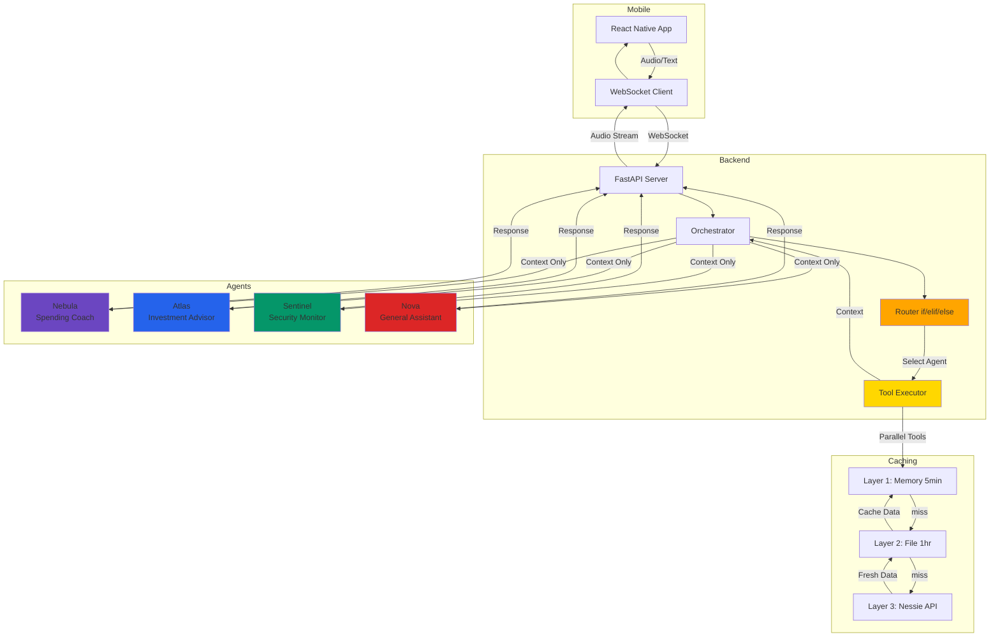
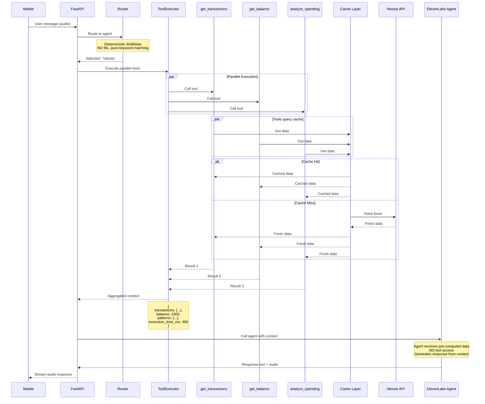
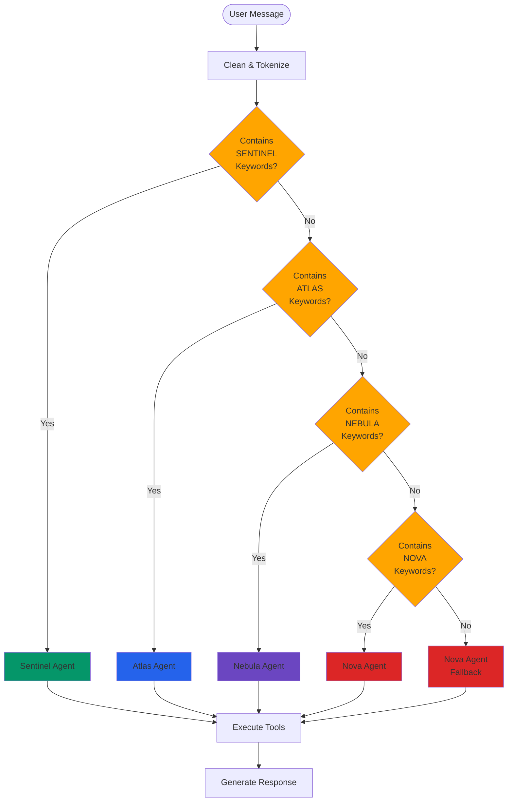
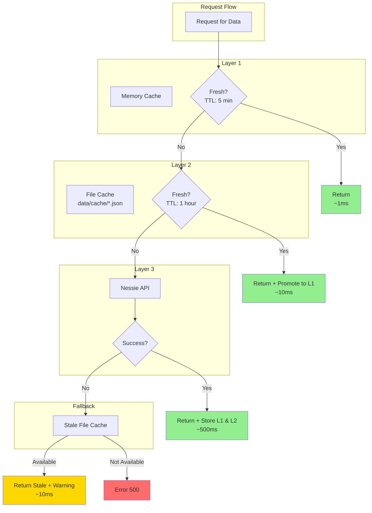
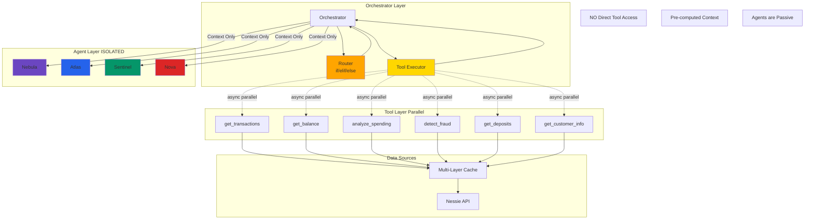
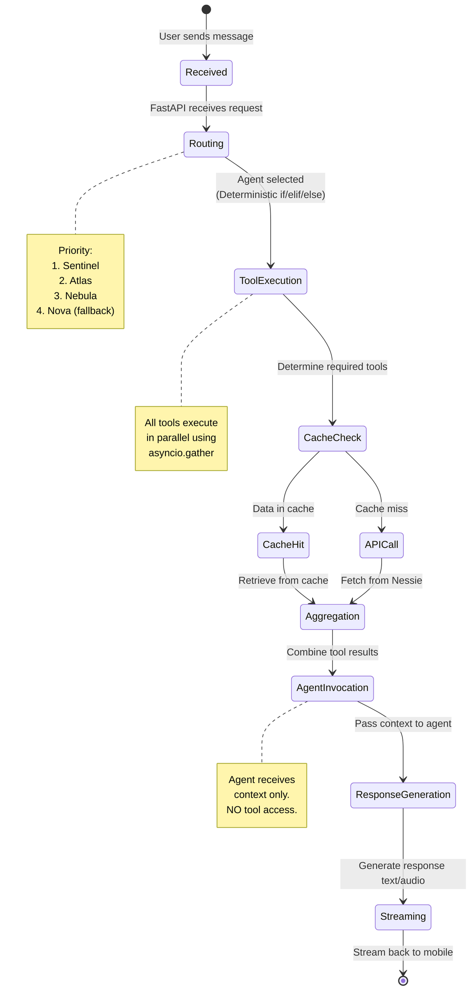
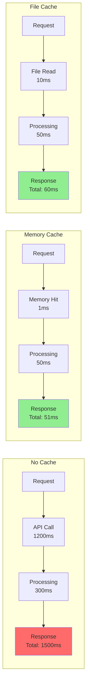
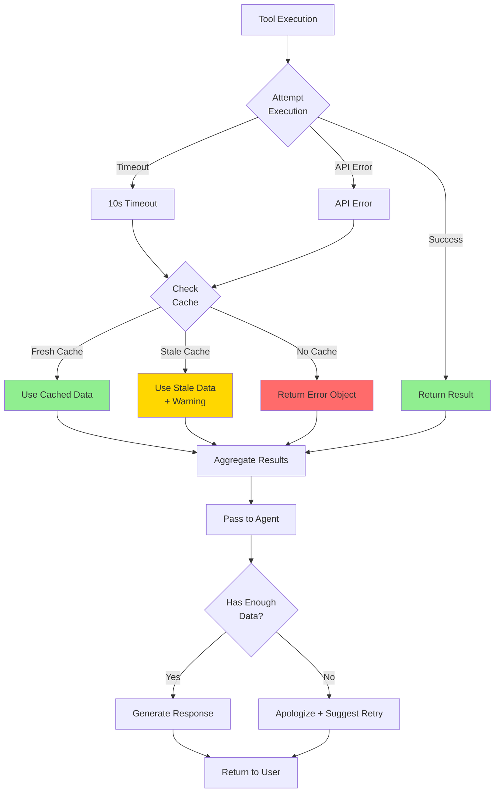
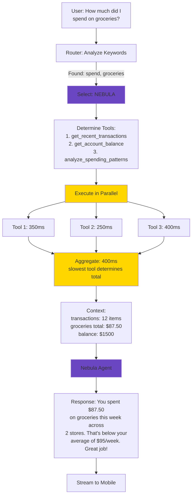
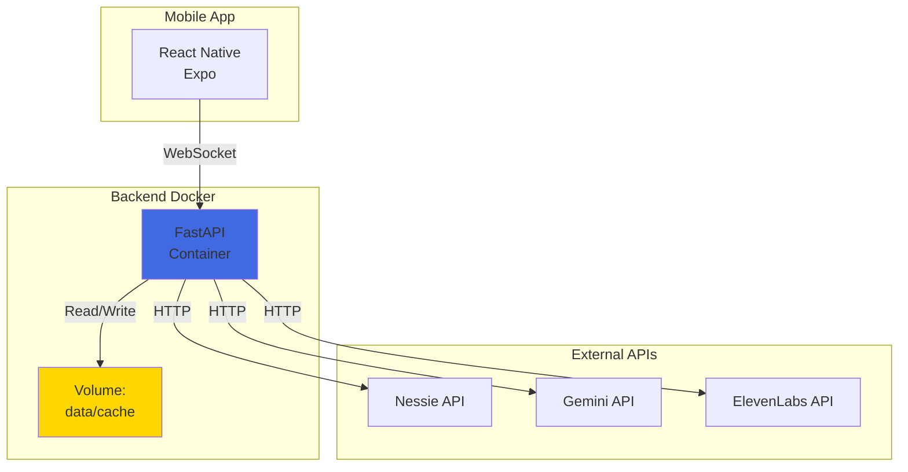

# Full Architecture

Complete system architecture with mermaid diagrams.

---

## System Overview



---

## Parallel Tool Execution Flow



---

## Deterministic Agent Routing



---

## Multi-Layer Cache Architecture



---

## Agent Isolation Model



---

## Request Lifecycle



---

## Caching Performance Impact



**Speedup**:
- Memory cache: **30x faster**
- File cache: **25x faster**

---

## Error Handling Flow



---

## Data Flow Example

### User Query: "How much did I spend on groceries?"



---

## Performance Metrics

### Without Optimizations
```
Sequential Tool Execution: 1000ms
No Caching: Every request hits API
Result: 1000-1500ms per request
```

### With Optimizations
```
Parallel Tool Execution: 400ms (2.5x faster)
Memory Cache (80% hit rate): 50ms (20x faster)
File Cache (15% hit rate): 60ms (17x faster)
API Call (5% miss rate): 500ms

Average: 80ms per request
```

**Overall Improvement: 18x faster on average**

---

## Deployment Architecture



---

## Summary

### Key Architectural Decisions

1. **Deterministic Routing**: `if/elif/else` for predictability
2. **Parallel Execution**: Minimize latency with `asyncio.gather`
3. **Multi-Layer Cache**: Memory → File → API with graceful degradation
4. **Agent Isolation**: Agents receive context, don't call tools
5. **Fail-Safe Design**: Fallbacks at every layer

### Benefits

- ✅ **Fast**: 50-500ms response time
- ✅ **Reliable**: Multiple fallback layers
- ✅ **Testable**: Deterministic behavior
- ✅ **Scalable**: Stateless, cache-friendly
- ✅ **Maintainable**: Clear separation of concerns
